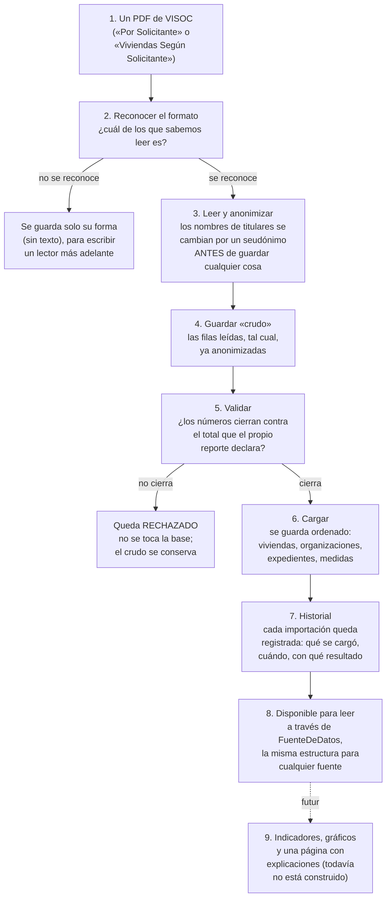

# Cómo funciona la capa de datos propia

**Para quién es este documento:** el equipo (Grupo 8) y cualquiera que necesite entender, sin ser
programador, para qué sirve lo que construimos en `datos/` desde el 26 de septiembre de 2026, cómo se
usa hoy y qué cambió respecto de lo que ya teníamos.

---

## 1. En una frase

Es el sistema que toma los reportes en PDF que exporta VISOC (el sistema que usa hoy el área), los
limpia, oculta los nombres de las personas, controla que los números cierren, y los guarda ordenados en
una base propia — lista para que, el día de mañana, el resto del proyecto (gráficos, indicadores, una
página web) la use sin importarle de dónde salieron los datos.

No es un reemplazo de VISOC ni de VIVSO (el sistema nuevo que está construyendo el equipo de
Programación). Es la capa de **análisis** que se alimenta de lo que esos sistemas ya producen.

## 2. Qué problema resuelve

Hasta ahora, todo el análisis del proyecto (PP1 y PP2) se hizo con datos **simulados**: un generador de
Python inventaba miles de viviendas y organizaciones con reglas realistas, para poder probar gráficos e
indicadores sin depender de tener acceso a datos reales.

Eso sirvió para aprender y para construir el tablero, pero tiene un límite: nunca íbamos a poder decirle
al área "esto refleja lo que está pasando de verdad" hasta tener un camino para cargar **sus** datos
reales. El problema es que esos datos reales no vienen en una base de datos prolija: vienen en PDF, con
un formato de tabla distinto según qué reporte se pida, y con nombres de personas que no podemos guardar
tal cual.

La capa de datos es la respuesta a ese problema: un camino completo, probado, para que un PDF real del
área termine convertido en filas confiables en una base propia.

## 3. Qué cambió y qué sigue igual

**Nada de lo que ya existía se rompió ni se reemplazó.** La capa de datos se construyó **al lado**, sumando
piezas nuevas.

| | Antes (PP1 / PP2) | Ahora, además |
| :--- | :--- | :--- |
| **De dónde salen los datos** | Un generador (`synthetic/generate.py`) inventa datos realistas en CSV | Un PDF real del área, procesado por un importador |
| **Dónde se guardan** | `data/*.csv` y, si se corre `db/setup.py`, `db/vivso_local.db` | Una base aparte, `db/datos_reales.db`, que **nunca** se mezcla con la simulada |
| **Cómo lo lee el tablero (Streamlit)** | `dashboard/components/data_loader.py` lee los CSV directamente | **Sigue exactamente igual.** El tablero todavía no toca la capa de datos nueva (ver sección 6) |
| **Esquema de la base** | `db/models.py`: vivienda, familia, organización, técnico, visita, avance de obra... | Las mismas tablas, con columnas nuevas agregadas (nunca se sacó ninguna), más un juego de tablas nuevas para catálogos y trazabilidad |
| **Nombres de personas** | Inventados por el generador (no son reales, no hace falta ocultarlos) | Los nombres reales de los titulares **se reemplazan por un seudónimo antes de guardar cualquier cosa** |
| **Command-line / API para cargar datos** | No existía | `python -m datos.importar archivo.pdf` |

En otras palabras: si hoy corrés el tablero como siempre, ves exactamente lo mismo que antes. La base
real y la simulada conviven, pero son dos cosas separadas — el sistema no las confunde ni las mezcla.

## 4. Cómo se usa hoy

Hoy la capa de datos se usa de dos formas: por línea de comandos para cargar un reporte, y desde código
Python para leer los datos que ya se cargaron.

### 4.1. Cargar un reporte nuevo

Desde la carpeta `vivso-python/`, con el archivo PDF a mano:

```
python -m datos.importar ruta/al/reporte.pdf
```

El sistema reconoce solo qué tipo de reporte es (hoy sabe leer dos formatos de VISOC, ver sección 5),
lo procesa, y te dice si quedó guardado, si hay algo para revisar, o si algo no cerró. Antes de poder
importar hace falta configurar una clave propia en el archivo `.env` (`ANON_SECRET`), que es la que se
usa para generar los seudónimos. Los detalles están en [`datos/README.md`](../datos/README.md).

### 4.2. Leer los datos ya cargados (para quien programe)

El resto del sistema (cuando construyamos indicadores, gráficos o una API) no tiene que saber si los
datos vienen de la base real, de los CSV simulados, o de un archivo de prueba: le pide los datos a
`FuenteDeDatos`, y esta le entrega siempre las mismas columnas, sin importar de dónde salieron.

```python
from datos.fuentes.registro import obtener_fuente

fuente = obtener_fuente()          # la real por defecto
viviendas = fuente.viviendas()     # siempre las mismas columnas, tenga o no tenga datos esa fuente
```

Se puede elegir la fuente con una variable de entorno (`FUENTE=simulada`, por ejemplo) o pasándola
directamente (`obtener_fuente("simulada")`). Esto es lo que en la sección 6 llamamos "el interruptor".

## 5. El ciclo de la información: de un PDF a un dato confiable

Este es el recorrido completo que hace un dato, paso por paso.



En criollo, cada paso:

1. **Llega un PDF.** Por ahora, dos tipos: uno con totales por organización ("Por Solicitante") y otro
   con una fila por vivienda ("Viviendas Según Solicitante").
2. **Se reconoce el formato.** El sistema prueba varios lectores y usa el que esté más seguro de que es
   suyo. Si ninguno lo reconoce, no se pierde: se guarda su forma (nunca su texto) para poder escribirle
   un lector después.
3. **Se anonimiza.** Cualquier nombre de una persona (el titular de una solicitud) se convierte en un
   nombre inventado, siempre el mismo para la misma persona, antes de que se escriba una sola línea en
   disco. El nombre real nunca queda guardado en ningún lado.
4. **Se guarda "crudo".** Las filas ya anonimizadas se guardan tal cual se leyeron, como respaldo. Esto
   sirve para poder reprocesar en el futuro sin volver a abrir el PDF.
5. **Se valida.** Cada reporte de VISOC trae sus propios totales al pie (por ejemplo, "Cantidad
   Solicitadas: 107"). El sistema suma lo que leyó y lo compara. Si no cierra, algo salió mal en la
   lectura o el reporte tiene un problema — y se rechaza antes de tocar nada.
6. **Se carga.** Si cierra, recién ahí se escribe en el modelo ordenado: la vivienda, la organización que
   la gestiona, los expedientes asociados, las medidas.
7. **Queda historial.** Cada importación (haya salido bien o mal) queda registrada: qué archivo era, cuándo
   se cargó, qué dio la validación. Si se importa un reporte más viejo después de uno más nuevo, se suma
   al historial, pero no pisa el estado actual de la vivienda.
8. **Queda disponible para leer.** Cualquier parte del sistema puede pedir esos datos a través de
   `FuenteDeDatos`, sin saber que atrás hubo un PDF.
9. **(Todavía no existe)** Con esos datos ya cargados, el paso que falta es calcular indicadores y
   mostrarlos con gráficos y explicaciones sencillas — ver sección 7.

## 6. El "interruptor" de fuentes

Como el sistema todavía no tiene acceso permanente a datos reales de sobra, se construyó una pieza que
deja **elegir** de dónde vienen los datos sin cambiar una línea de código en lo que los consume:

| Fuente | De dónde saca los datos | Para qué sirve |
| :--- | :--- | :--- |
| `propia` (la que se usa si no se dice nada) | `db/datos_reales.db`, los reportes ya importados | Trabajar con lo real, a medida que entren más exports |
| `simulada` | Los CSV de siempre (`data/`) | El tablero público, que no debe mostrar nunca datos reales |
| `json_prueba` | Un archivo mínimo (`datos_prueba/ejemplo.json`) | Probar que todo el sistema funciona, sin PDF ni base |

Un dato que una fuente no tiene (por ejemplo, la simulada no tiene "medidas por organización", porque
eso solo sale de un reporte real) no rompe nada: la columna existe igual, vacía, y el sistema puede
avisar "esto no está disponible con la fuente actual" en vez de fallar.

## 7. Qué falta (para ser honestos)

- **El tablero (Streamlit) todavía no lee de la base real.** Sigue leyendo los CSV simulados, como
  siempre. Conectarlo a `FuenteDeDatos` es un paso aparte, pantalla por pantalla, porque conviene
  verificarlo corriendo la aplicación y no solo con pruebas automáticas.
- **Ya se pueden calcular 6 indicadores** (qué se construye, cuánto termina, hace cuánto se espera, qué
  tanto se activa por organización, quién pide más, y cuánto tarda el proceso), cada uno con su
  explicación en lenguaje llano. Lo que falta es mostrarlos en una pantalla con gráficos — eso es un
  paso aparte — y los que dependen de GDE o de precios, que esperan sus importadores.
- **Solo sabemos leer dos formatos de reporte de VISOC.** Para sumar otro (por ejemplo, de GDE o de
  precios), hace falta escribir un lector nuevo — el sistema ya está pensado para eso (por eso guarda la
  "forma" de los archivos que no reconoce), pero cada formato nuevo es trabajo adicional.
- **Hay cosas que anotamos como "a confirmar con el área"** porque los datos que tenemos no alcanzan para
  estar seguros: qué significa exactamente que una solicitud esté "activada", por qué a veces se repite
  un número de expediente en varias filas del mismo reporte, y qué es la marca "DES" (desaprobada). El
  sistema funciona igual mientras tanto, pero esos puntos quedan marcados con menor "confianza" en la
  ficha de cada reporte.

## 8. Glosario

- **VISOC:** el sistema que usa hoy el área para gestionar las solicitudes de vivienda. Es viejo y solo
  permite exportar en PDF, con tablas de formato distinto según qué se pida.
- **VIVSO:** el sistema nuevo que está construyendo el equipo de Programación para reemplazar a VISOC.
  Todavía no está en uso; cuando lo esté, va a ser otra fuente más de datos, con la misma estructura
  común.
- **Anonimizar:** cambiar el nombre real de una persona por uno inventado, de forma que siempre sea el
  mismo inventado para la misma persona, pero que no se pueda volver atrás sin la clave.
- **Importar:** el proceso completo de leer un PDF y terminar con sus datos guardados de forma ordenada
  (o rechazados, si algo no cierra).
- **Base propia / base simulada:** dos archivos de base de datos separados. La propia tiene lo que se
  fue importando de reportes reales; la simulada es la de siempre, con datos inventados por el
  generador de PP2.
- **Fuente de datos:** de dónde vienen los datos que consume el resto del sistema (la base propia, la
  simulada, o un archivo de prueba). El "interruptor" (sección 6) elige cuál usar.
- **Catálogo:** una lista fija de valores conocidos (por ejemplo, los 27 departamentos, o las 15
  clasificaciones de vivienda) que se usa para no repetir ni escribir mal esos valores en cada dato.
- **Trazabilidad:** que quede un registro de cada carga de datos (qué archivo, cuándo, con qué
  resultado), para poder responder "¿de dónde salió este número?" en cualquier momento.
