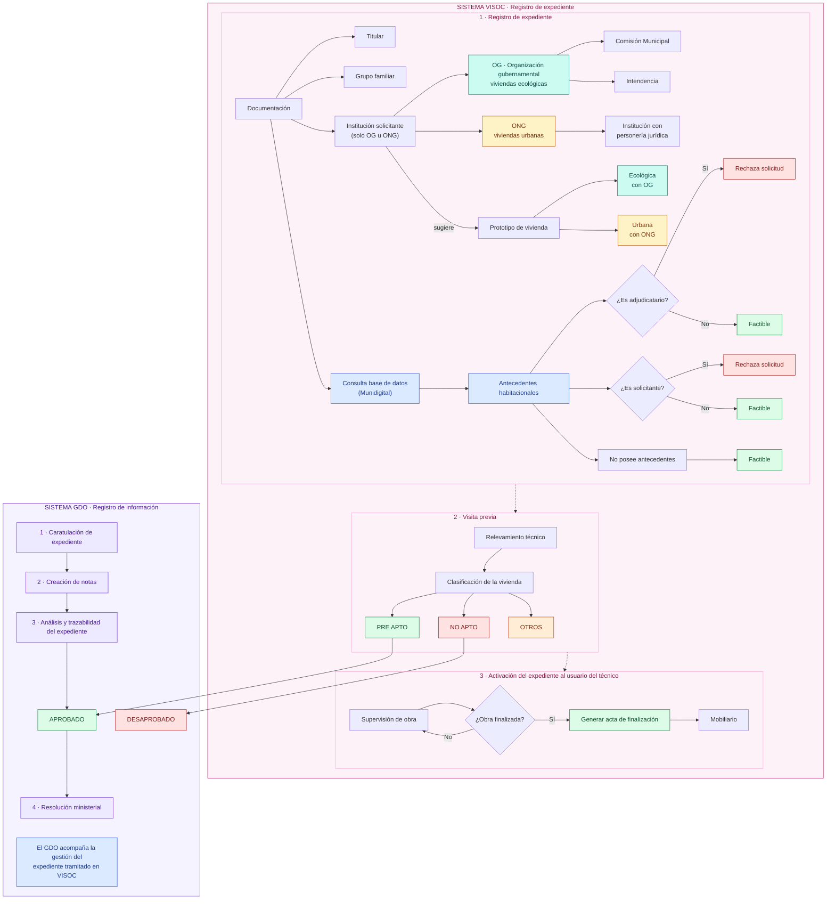

# Flujo de trabajo del Programa de Viviendas Sociales

Esta es la versión en Mermaid del diagrama de flujo que armó el área (*Diagrama de flujo del Programa
de Viviendas Sociales*, versión 6). Muestra el recorrido de una solicitud por los dos sistemas que
usa hoy el programa:

- **VISOC**, donde se registra el expediente y se sigue la obra.
- **GDO**, donde se tramita el expediente administrativo. El diagrama lo llama GDO; en el resto de
  la documentación del proyecto lo llamamos **GDE** (el sistema de expedientes electrónicos).
  Entendemos que es el mismo sistema; queda para confirmar con el área.

El PDF original está en la carpeta local `pantallas/`, junto con las capturas de pantalla de VISOC.
Esa carpeta no se sube al repositorio porque las capturas muestran datos personales reales.

## Diagrama

## Cómo leerlo

- **Colores**, los mismos del original: verde para un resultado favorable, rojo para un rechazo o
  una vivienda no apta, naranja para otros casos y azul para una consulta a otro sistema. En el
  original, el verde azulado y el ámbar indican qué prototipo va con cada tipo de institución: la
  vivienda ecológica con una OG y la urbana con una ONG.
- **Las tres fases de VISOC** están numeradas como en el original. El PDF no dibuja flechas entre
  una fase y la siguiente. Las flechas punteadas se agregaron acá solo para marcar ese orden.
- **Las dos flechas que cruzan de un sistema al otro** sí están en el original. Si en la visita
  previa la vivienda resulta *pre apta*, eso acompaña la aprobación en GDO. Si resulta *no apta*,
  lleva a la desaprobación.

## Dónde se ve cada paso en VISOC

Las capturas de pantalla de VISOC permiten ubicar cada paso del diagrama en una pantalla concreta.
El modelo de datos que armamos a partir de ellas está en [modelo-de-datos.md](modelo-de-datos.md).

| Paso del diagrama | Pantalla de VISOC | Qué se registra |
| :--- | :--- | :--- |
| Registro de expediente | «Seleccione un Expediente» y ficha del expediente | Número, fecha y organización solicitante. Un expediente agrupa varias viviendas. |
| Documentación: titular y grupo familiar | Ficha de la vivienda y «Grupo Familiar» | Titular e integrantes: DNI, nombre, año de nacimiento («Clase») y si es titular o familiar |
| Documentación: institución solicitante | «Solicitantes» y «Autoridades» | Tipo, personería jurídica, CUIT, estado y autoridades de cada período |
| Consulta a Munidigital | No aparece: es otro sistema | — |
| Visita previa y clasificación | «Inspección Previa» | Fecha, técnico, clasificación (código y criterio), tipo de vivienda y ubicación |
| Activación | «Activación» del expediente | Estado, tipo de vivienda, dormitorios, monto, técnico del acta y números de expediente de activación y de reconsideración |
| Supervisión de obra | «Avance de Obra» e «Inspección Técnica» | Hasta 4 inspecciones, con el porcentaje de cada uno de los 17 rubros y el avance total (AFO) |
| ¿Obra finalizada? | «Fin de Obra» | Fecha y número de resolución |
| Acta de finalización | «Acta Recepción» (acta digital) | Número de expediente del acta y técnico |
| Mobiliario | «Acta Mobiliario» | No vimos esta pantalla abierta |
| Trámite en GDO | No hay capturas | — |

VISOC registra además cosas que el diagrama no muestra: la suspensión y la reactivación de una
obra, la sustitución del titular, la baja, el archivo del expediente, los reclamos, los documentos
adjuntos y la agenda de trabajo de cada técnico.

## Puntos para confirmar con el área

1. **Cuándo se activa una vivienda.** El diagrama pone la activación antes de la supervisión de
   obra. Pero el 02-09-2026 el área explicó por audio que la activación se hace cuando el técnico
   certifica el 100 % de la obra, justo antes del acta (`informe_ong_og_2026/DECISIONES.md`,
   punto 13). Las dos versiones pueden ser ciertas si son dos momentos distintos: uno en que se
   asigna el técnico y otro en que se aprueba el monto. Los datos lo pueden resolver: alcanza con
   comparar la fecha de activación de cada vivienda con las fechas de sus inspecciones de avance.
2. **GDO y GDE.** Si son el mismo sistema con dos nombres.
3. **La resolución ministerial y la activación.** El diagrama no une el paso 4 de GDO con la
   activación en VISOC. Falta saber si la activación espera a la resolución.
4. **Mobiliario.** Si es un acta aparte (en VISOC hay un botón «Acta Mobiliario») o la entrega del
   mobiliario en sí.
