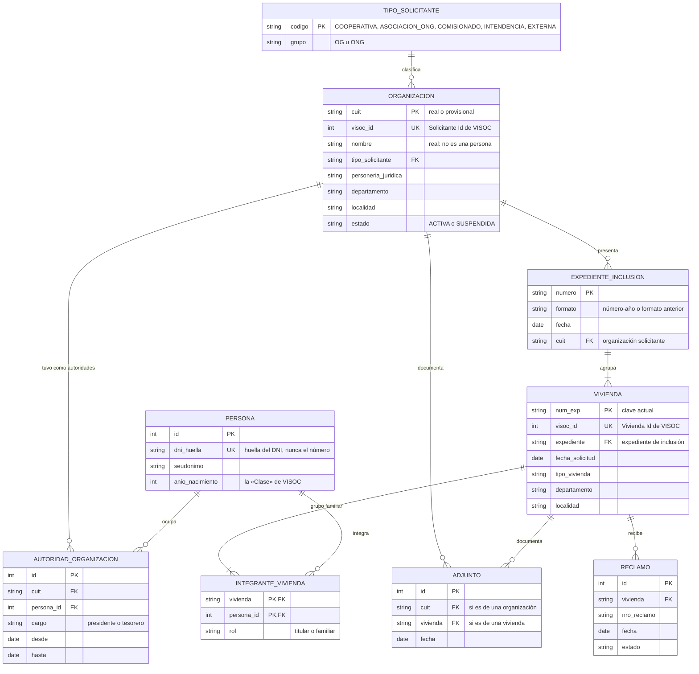
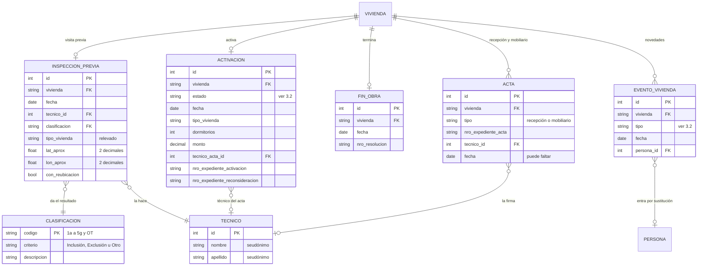
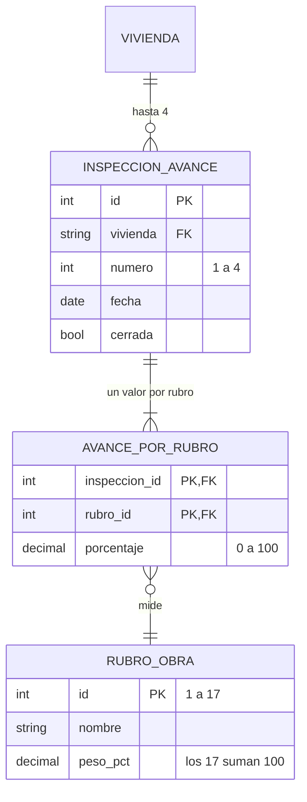

# Modelo de datos de VISOC para análisis

**Para quién es este documento:** el equipo (Grupo 8) y cualquiera que necesite saber qué datos
guarda VISOC y cómo los ordenamos para analizarlos. Se armó el 30 de septiembre de 2026 a partir de
las capturas de pantalla del sistema.

Los esquemas usan Mermaid: se ven en GitHub y en VS Code con una extensión de Mermaid. El flujo del
programa, graficado a partir del diagrama del área, está en [flujo-del-programa.md](flujo-del-programa.md).

---

## 1. Qué queremos lograr

El importador de la capa de datos se armó esperando ejemplos de lo que exporta VISOC. En su lugar,
el área pasó 33 capturas de pantalla del sistema y el diagrama de flujo del programa. Las pantallas
muestran qué guarda VISOC: qué datos tiene cada ficha, cómo se relacionan y en qué orden se cargan.
Con eso ya se puede modelar la base de datos, sin esperar a los exports.

El objetivo es un modelo **sencillo pero completo** de la base de datos para análisis, que cumpla
cuatro condiciones:

- cubrir todo lo que muestran las pantallas, desde la solicitud hasta el acta de mobiliario;
- leerse fácil: una tabla por paso del proceso y una vista con una fila por vivienda para analizar;
- seguir las reglas de datos personales del proyecto;
- sumarse a la capa de datos que ya existe, sin romper lo que funciona.

Por eso el modelo reutiliza las tablas que ya tiene la capa de datos (catálogos, organizaciones,
viviendas, números de expediente y el registro de cada importación) y agrega las que faltan. Las
tablas del prototipo que simulan el sistema nuevo, VIVSO, quedan como están, porque modelan otro
sistema.

## 2. Qué muestran las pantallas

Cada hallazgo indica la pantalla donde se ve. Las capturas quedan en la carpeta local `pantallas/`,
que no se sube al repositorio porque muestran datos personales reales.

1. **Un expediente agrupa varias viviendas.** Para cargar una vivienda nueva, VISOC pide primero
   elegir un expediente existente («Seleccione un Expediente»: número, fecha y solicitante). En
   «Consulta de Expedientes» y en «Reclamos», varios titulares distintos comparten el mismo número.
   El expediente es de la organización solicitante y reúne a varias familias. Eso explicaría las 64
   de 107 filas con expediente repetido del reporte de Lugones: no serían un error, sino la forma en
   que funciona el sistema. Falta confirmarlo con el área (§ 8).
2. **VISOC guarda el CUIT de cada organización** (ficha del solicitante, «Nº de CUIT»), además de su
   personería jurídica, su estado (activo o suspendido) y un historial de autoridades por período
   (presidente y tesorero). Los reportes en PDF no traen el CUIT; por eso hoy usamos uno provisional.
3. **Viviendas y organizaciones tienen un identificador interno**: «Vivienda Id» (en la inspección
   previa) y «Solicitante Id» (en la ficha del expediente). Si un export los trae, identifican mejor
   que el número de expediente.
4. **«Clase» es el año de nacimiento** de cada integrante del grupo familiar (hay valores como 1972
   o 2005). Cada integrante figura como titular o como familiar.
5. **La visita previa guarda la clasificación de la vivienda** (los mismos 15 códigos del catálogo
   que ya tenemos), el técnico, la fecha, el tipo de vivienda y la ubicación: coordenadas de origen
   y, si la vivienda se reubica, de reubicación. El criterio de la clasificación (Inclusión,
   Exclusión u Otro) coincide con los tres resultados del diagrama: pre apto, no apto y otros.
6. **La activación es por vivienda y tiene monto.** Guarda el estado (sin activar, aprobada,
   rechazada, baja o cambio de beneficiario), el tipo de vivienda, los dormitorios, el monto, la
   fecha, el técnico del acta y los números de expediente de activación y de reconsideración. En el
   informe OG/ONG el monto se tuvo que estimar porque los reportes no traen el tipo de vivienda de
   cada activada: VISOC sí lo tiene. Y el «expediente de activación» del patrón «#DES», que no se
   había encontrado en ningún archivo, es un campo de esta pantalla.
7. **El avance de obra se mide con 17 rubros y hasta 4 inspecciones.** Cada inspección tiene fecha,
   una marca de cerrada y un porcentaje por rubro. El avance total (AFO) suma los porcentajes de los
   rubros, ponderados por su peso. La lista de 17 aparece igual en dos capturas de fechas distintas,
   una de ellas [capturas/afo.jpeg](capturas/afo.jpeg), que ya estaba en el repositorio. Los pesos
   reales (§ 3.2) no son los del prototipo.
8. **El fin de obra se carga para varias viviendas a la vez**, con fecha, hora, número de
   resolución y observación. Recién después se habilitan el acta de recepción (acta digital: número
   de expediente del acta y técnico) y el acta de mobiliario.
9. **Cada técnico tiene una agenda** con sus viviendas: fecha de solicitud, inspección previa,
   activación, AFO y fin de obra. Los técnicos son usuarios del sistema. Coincide con el título de
   la fase 3 del diagrama: «activación del expediente al usuario del técnico».
10. **Hay pasos que no vimos abiertos:** suspensión y reactivación, sustitución del titular,
    archivo, novedades, acta de mobiliario y «Cargar Act. Hist.». Se modelan de forma genérica
    (§ 3.3).
11. **VISOC parece estar hecho con GeneXus**: su visor de reportes abre archivos `.gxr`. Eso sugiere
    una base de datos relacional por detrás, con tablas parecidas a estas pantallas. Si algún día hay
    acceso de lectura, este modelo se puede llenar tabla por tabla.

## 3. El modelo

### 3.1 Mapa general

Son tres diagramas, para que cada uno se lea bien: quién pide y para quién; la visita previa, la
activación y el cierre; y el avance de obra. Las tablas de soporte que ya existen
(`importacion`, `registro_crudo`, `tipo_reporte`, `vivienda_foto`, `medida_organizacion`,
`medida_categoria`, `organizacion_alias` y el índice `expediente`) no se dibujan porque no cambian.
Toda fila nueva guarda de qué importación salió (`origen_importacion_id`), igual que hoy.

**Quién pide y para quién**

**Cómo avanza cada vivienda: visita previa, activación y cierre**

**Cómo avanza cada vivienda: avance de obra**

### 3.2 Catálogos

- **Ya existen y no cambian:** `clasificacion` (15), `tipo_solicitante` (5), `tipo_vivienda`,
  `departamento` (27) y `localidad`. Las pantallas confirman los 15 códigos de clasificación y los
  5 tipos de solicitante tal como están.
- **`rubro_obra`**: en la base de datos reales se cargan los 17 rubros de VISOC. Los pesos salen
  del cuadro de avance de una obra terminada: con todos los rubros al 100 %, el AFO de cada rubro
  es igual a su peso.

  | Nº | Rubro | Peso (%) |
  | ---: | :--- | ---: |
  | 1 | Cimientos (cavado y llenado) | 9 |
  | 2 | Encadenado inferior y capa aisladora | 8 |
  | 3 | Mampostería de ladrillo visto | 5 |
  | 4 | Mampostería de ladrillo cerámico / block | 17 |
  | 5 | Columnas de encadenado | 3 |
  | 6 | Encadenado superior | 9 |
  | 7 | Cubierta de chapa | 10 |
  | 8 | Revoque interior | 3 |
  | 9 | Revoque exterior | 3 |
  | 10 | Cielorraso con aislante térmico | 8 |
  | 11 | Piso / contrapiso de nivelación | 4 |
  | 12 | Colocación de aberturas | 6 |
  | 13 | Fogón | 4 |
  | 14 | Instalación eléctrica | 3 |
  | 15 | Instalación de agua / tanque | 6,5 |
  | 16 | Pintura interior - exterior | 0,5 |
  | 17 | Aleros | 1 |
  | | **Total** | **100** |

  El prototipo usa otros 15 rubros con otros pesos (`db/setup.py`). Los dos catálogos pueden
  convivir porque viven en bases distintas: el del prototipo en la base simulada y el real en
  `db/datos_reales.db`. Como hay pesos con decimales, la columna `rubro_obra.peso_pct` pasa de
  número entero a decimal.
- **Valores fijos**, sin tabla propia (la lista queda documentada acá):
  - estado de la activación: `SIN_ACTIVAR`, `APROBADA`, `RECHAZADA`, `BAJA`,
    `CAMBIO_BENEFICIARIO`. VISOC escribe «Cambio Veneficiario», y el importador tiene que
    reconocerlo así;
  - rol en el grupo familiar: `titular` o `familiar`;
  - cargo de una autoridad: `presidente` o `tesorero`;
  - tipo de acta: `recepcion` o `mobiliario`;
  - tipo de evento: `suspension`, `reactivacion`, `sustitucion`, `archivo` o `novedad`;
  - estado de una organización: `ACTIVA` o `SUSPENDIDA`. VISOC dice «ACTIVO» y «SUSPENDIDO»; se
    traducen a los valores que ya usa la tabla.

### 3.3 Reglas del modelo

- **El expediente de inclusión es de la organización.** `expediente_inclusion` guarda el número, el
  formato, la fecha y el solicitante. El nombre lo usa el propio VISOC: el acta de recepción habla
  de «Expediente de INCLUSIÓN». Cada vivienda apunta a su expediente por la columna
  `vivienda.expediente`, que ya existe. `vivienda.cuit_org` se mantiene y tiene que coincidir con el
  solicitante del expediente: el importador lo controla.
- **La clave de la vivienda no cambia por ahora.** Sigue siendo `num_exp`: el expediente más una
  huella del titular. Las pantallas muestran un riesgo nuevo: con una sustitución cambia el titular
  y, con él, la clave, así que el reporte siguiente crearía una vivienda «nueva». Por eso se agrega
  `vivienda.visoc_id`, para guardar el «Vivienda Id» cuando un export lo traiga. Mientras tanto
  queda como un límite conocido del importador actual.
- **Una persona, una fila.** `persona` reúne a titulares, familiares y autoridades de
  organizaciones, identificados por la huella del DNI. Así se puede ver si una misma persona aparece
  en más de un expediente, que es lo que el área consulta en Munidigital, sin guardar el DNI. Los
  técnicos van aparte, en `tecnico`: son personal del área y VISOC no guarda su DNI.
- **El resultado de la visita previa sale del criterio.** No se guarda aparte. Inclusión es pre
  apto, Exclusión es no apto y Otro es otros. `vivienda.clasificacion` y `vivienda.criterio` quedan
  como copia del último resultado, para no romper los indicadores actuales.
- **Una activación por vivienda, con su estado actual.** Si una activación rechazada se aprueba
  después de una reconsideración, la fila se actualiza y el número de reconsideración queda
  guardado. La historia de los cambios sale de las fotos de cada reporte (`vivienda_foto`), como hoy.
- **El AFO se calcula.** El AFO de una vivienda es la suma, rubro por rubro, del porcentaje de la
  última inspección por el peso del rubro, dividida por 100. Esa fórmula supone que el porcentaje
  de cada inspección es acumulado (§ 8). Lo que diga un reporte se sigue guardando en
  `vivienda_foto.avance_obra`, y la diferencia entre los dos valores sirve de control.
- **Los pasos sin pantalla vista van a una sola tabla.** Suspensión, reactivación, sustitución,
  archivo y novedades van a `evento_vivienda`, con el tipo, la fecha y, en una sustitución, la
  persona que entra. Cuando veamos esas pantallas se agregan los campos que falten.
- **Los números de expediente también se anotan en el índice.** Cada número (de inclusión, de
  activación, de reconsideración, de datos del grupo familiar, de acta y de reclamo) se sigue
  anotando con su tipo en la tabla `expediente`, que ya existe. Así se puede encontrar una vivienda
  por cualquiera de sus números.
- **Solo VISOC.** El modelo cubre lo que registra VISOC. El trámite administrativo en GDE queda
  afuera, aunque aparece en el diagrama de flujo del programa.

### 3.4 Vista para análisis

`vista_vivienda_ciclo` tiene una fila por vivienda con todo su recorrido, lista para Excel, Power BI
o pandas. Es una vista de la base de datos: una consulta guardada que se lee como una tabla. No
duplica datos y está siempre al día.

| Grupo | Columnas |
| :--- | :--- |
| Identificación | `num_exp`, expediente, organización, tipo de solicitante, grupo (OG u ONG), departamento, localidad, tipo de vivienda |
| Familia | cantidad de integrantes, edad del titular al solicitar, cantidad de menores de 18 al solicitar |
| Visita previa | fecha, clasificación, resultado (pre apto, no apto u otros) |
| Activación | estado, fecha, dormitorios, monto |
| Obra | cantidad de inspecciones, fecha de la última, AFO calculado |
| Cierre | fecha de fin de obra, si tiene acta de recepción, si tiene acta de mobiliario |
| Novedades | si está suspendida, si está archivada, cantidad de sustituciones, cantidad de reclamos |
| Tiempos, en días | de la solicitud a la visita previa, de la visita previa a la activación, de la activación al fin de obra |
| Etapa | el último paso registrado: solicitada, con visita previa, activada, en obra, obra terminada o con acta de recepción |

Algunas columnas se calculan:

- **La edad** sale del año de nacimiento y del año de la solicitud.
- **Una vivienda está suspendida** si su último evento de suspensión no tiene una reactivación
  posterior.
- **La etapa** se decide por las fechas de cada paso. «En obra» quiere decir que tiene al menos una
  inspección de avance. Así la etapa no depende de si la activación va antes o después de la obra,
  que todavía está por confirmar (§ 8). Si la vivienda está archivada, suspendida, rechazada o dada
  de baja, la etapa muestra eso en su lugar.

## 4. Datos personales

Valen las reglas de anonimización de la capa de datos (ver
[como-funciona-la-capa-de-datos.md](../capa-de-datos/como-funciona-la-capa-de-datos.md)), extendidas
a los datos nuevos:

| Dato en VISOC | En el modelo |
| :--- | :--- |
| Nombres de titulares, familiares, autoridades y técnicos | Seudónimo, como hoy |
| DNI | Huella calculada con la clave secreta del proyecto (`ANON_SECRET`), nunca el número. **Esto cambia una regla:** hoy el DNI se descarta. La huella permite reconocer a la misma persona en distintos expedientes, y sin la clave no se puede volver al número. |
| «Clase» (año de nacimiento) | Se guarda. En un tablero público se muestra solo por rangos de edad |
| Coordenadas de la vivienda | Redondeadas a 2 decimales (cerca de 1 km), más una marca de si se reubica |
| Teléfono, correo, domicilio y código de pago electrónico | No se guardan |
| Usuario y contraseña de los técnicos | Nunca |
| Observaciones y descripción de los adjuntos (texto libre) | No se guardan, igual que el texto libre de los demás exports. Solo se anota si había una observación |
| Nombre de la organización | Real, como hoy: no es una persona |

## 5. Cómo encaja con lo que ya existe

| En el modelo | Hoy en el código | Qué cambia |
| :--- | :--- | :--- |
| `organizacion` | `organizacion` (`db/models.py`) | Se agregan `visoc_id`, `personeria_juridica`, `departamento` y `localidad`. Cuando un export traiga el CUIT, reemplaza al provisional (ya está previsto). |
| `autoridad_organizacion` | No existe. El prototipo tiene `presidente` y `dni_presidente` en la organización | Nueva |
| `expediente_inclusion` | No existe. El número ya está en `vivienda.expediente` | Nueva |
| `vivienda` | `vivienda` | Se agrega `visoc_id`. `vivienda.expediente` pasa a apuntar a `expediente_inclusion` |
| `persona`, `integrante_vivienda` | No existen. `familia` e `integrante_familia` son del prototipo y guardan DNI y nombre sin anonimizar, para datos simulados | Nuevas. Las del prototipo no se tocan |
| `inspeccion_previa` | No existe. `visita` es del prototipo de VIVSO | Nueva |
| `activacion` | Solo la fecha, por reporte, en `vivienda_foto.fecha_activacion` | Nueva |
| `inspeccion_avance`, `avance_por_rubro` | No existen. `avance_rubro` es del prototipo: un solo porcentaje por rubro, sin inspecciones | Nuevas |
| `rubro_obra` | `rubro_obra`, con los 15 rubros del prototipo | Se cargan los 17 reales en la base de datos reales. `peso_pct` pasa a decimal |
| `fin_obra` | Solo la fecha, por reporte, en `vivienda_foto.fecha_fin_obra` | Nueva |
| `acta` | Los números, en `expediente` y en `vivienda_foto.exp_acta` | Nueva. El número se sigue anotando también en el índice |
| `evento_vivienda` | No existe | Nueva |
| `reclamo` | `reclamo` (organización, expediente, fecha y estado) | Se agregan `vivienda` y `nro_reclamo` |
| `adjunto` | No existe | Nueva |
| `tecnico` | `tecnico` (prototipo) | Se reutiliza: nombre y apellido guardan el seudónimo; DNI, correo y teléfono quedan vacíos |
| `vista_vivienda_ciclo` | No existe | Nueva |

Los importadores actuales siguen funcionando igual, y los 6 indicadores de hoy no cambian. Los
datos nuevos habilitan indicadores nuevos (§ 7).

## 6. Cómo se llena

- **Con los reportes que ya importamos** («Por Solicitante» y «Viviendas Según Solicitante») hoy se
  llenan `organizacion`, `vivienda`, `vivienda_foto` y el índice `expediente`. Con un ajuste chico
  del importador se llenan también `expediente_inclusion` (el número y la organización ya vienen en
  el reporte) y los números de reclamo y de acta, en `reclamo` y en `acta`.
- **Con otras salidas de VISOC** se llenaría el resto. Las pantallas muestran varias que ya existen
  y se podrían pedir al área:
  - la grilla de «Activación» de cada expediente: tipo, dormitorios, monto y estado de cada
    vivienda. Daría montos exactos en lugar de estimados;
  - el reporte «Avance de obra para ACTA DE RECEPCIÓN»: grupo familiar, técnico y porcentaje de cada
    rubro en cada inspección;
  - el «Grupo Familiar» (tiene botón Imprimir) y la «Consulta de Expedientes»: integrantes con su año
    de nacimiento;
  - la ficha de «Solicitantes» con sus «Autoridades»: CUIT, personería y autoridades por período.

Una nota para los importadores: en VISOC, el nombre de la organización puede traer entre paréntesis
su matrícula o su personería («(Mat. N…)», «(P.J. …)»). Hay que separar ese dato antes de
normalizar el nombre, para que coincida con el de los otros reportes, y aprovecharlo para llenar
`personeria_juridica`.

## 7. Preguntas que el modelo permite responder

| Pregunta | Con qué datos |
| :--- | :--- |
| ¿Cuánto tarda cada etapa y dónde se traban las viviendas? | La vista, por organización, técnico, departamento y tipo |
| ¿Qué organizaciones tienen más viviendas excluidas en la visita previa, y por qué clasificación? | `inspeccion_previa` y `clasificacion` |
| ¿Cuántas activaciones se rechazan, cuántas se reconsideran y cuántas terminan aprobadas? | `activacion` |
| ¿Cuánto dinero se activó por organización, tipo de solicitante y departamento? | `activacion.monto` |
| ¿En qué rubro se frenan las obras? | `inspeccion_avance`, `avance_por_rubro` y `rubro_obra` |
| ¿Cómo son los grupos familiares y cuántos dormitorios reciben? ¿Se cumple la regla del informe OG/ONG (un dormitorio con un beneficiario, dos con más)? | `integrante_vivienda`, `persona` y `activacion` |
| ¿Hay personas en más de un expediente? | `persona` (huella del DNI) |
| ¿Hay organizaciones con autoridades vencidas que siguen presentando expedientes? ¿Una misma persona preside varias? | `autoridad_organizacion` y `expediente_inclusion` |
| ¿Cuánta obra en curso tiene cada técnico? | `activacion.tecnico_acta_id` y `fin_obra` |
| ¿Cuántas de las solicitudes de 2026 ya están terminadas? (quedó pendiente en el informe OG/ONG) | La vista |

## 8. Para confirmar con el área

1. **Que un expediente de inclusión agrupe varias viviendas.** Si se confirma, el importador deja de
   avisar el expediente repetido como anomalía.
2. **Cuándo se activa una vivienda**: antes de la obra, como dice el diagrama, o al 100 % de la obra,
   como explicó el área por audio el 02-09-2026. Cambia cómo se lee el indicador «tiempos del
   proceso», que hoy mide de la activación al fin de obra. Los datos lo pueden resolver: ver el
   documento del flujo.
3. **Que el criterio de la clasificación sea el resultado de la visita previa** (pre apto, no apto y
   otros).
4. **Qué mide el porcentaje de cada inspección:** el avance acumulado del rubro (lo más probable) o
   lo avanzado desde la inspección anterior. Cambia la fórmula del AFO.
5. **Si los 17 rubros son los mismos para vivienda urbana y ecológica.** La lista incluye «Fogón».
6. **Qué número se carga como expediente de activación y como expediente de reconsideración.**
7. **Qué registran las pantallas que no vimos abiertas:** suspensión y reactivación, sustitución,
   archivo, novedad, acta de mobiliario y «Cargar Act. Hist.».
8. **Si VISOC puede sacar alguna de las salidas de la sección 6**, y si alguna trae el «Vivienda Id».

## 9. Qué no cubre

- La construcción: las tablas nuevas, los importadores y la vista todavía no están hechos. Este
  documento describe el modelo; construirlo es un paso aparte.
- Cambiar los indicadores actuales o el tablero.
- GDE: este modelo cubre solo VISOC.
- Leer el texto libre de las observaciones para sacar datos.

Quedan para actualizar los documentos que describen el AFO con los 15 rubros del prototipo como si
fueran los de VISOC: `README.md`, `docs/analisis/documentacion-analisis.md`,
`docs/pendientes/supuestos-abiertos.md` y `docs/vision/vision-afo.md`. Los porcentajes de
`vision-afo.md` se tendrían que recalcular con los pesos reales. En
`docs/pendientes/datos-a-confirmar.md`, la pregunta de si siguen vigentes los pesos de los rubros ya
tiene respuesta.

## 10. Palabras que usamos

- **Huella:** un código que se calcula a partir de un dato (por ejemplo, un DNI) con una clave
  secreta. El mismo dato da siempre la misma huella, pero sin la clave no se puede volver al dato.
- **Seudónimo:** un nombre inventado que reemplaza al real. Es siempre el mismo para la misma
  persona.
- **Clave de una tabla:** la columna que identifica cada fila sin repetirse.
- **Vista:** una consulta guardada en la base de datos que se lee como una tabla, pero no guarda
  datos propios.
- **Catálogo:** una tabla chica con los valores posibles de algo, por ejemplo, las 15
  clasificaciones.
- **AFO:** avance físico de obra, en porcentaje.
- **Expediente de inclusión:** el expediente que presenta una organización y que reúne a varias
  familias.
- **GDE / GDO:** el sistema de expedientes electrónicos donde se tramita la parte administrativa.
  Aparece en el diagrama de flujo, pero no en este modelo.
